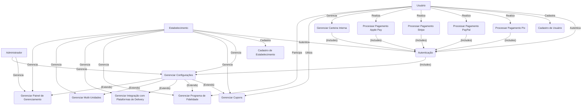

# Documento de Especificação de Casos de Uso

## Capa

**Projeto:** Prato na Web

**Documento:** Especificação de Casos de Uso

**Versão:** 1.0

**Data:** 6 de junho de 2025

**Elaborado por:** team_etheu

---

## Índice

1.  Objetivo
2.  Identificação de Atores
3.  Identificação de Casos de Uso
4.  Diagrama de Casos de Uso
5.  Detalhamento de Casos de Uso
    * UC001: Autenticação
    * UC002: Cadastro de Usuário
    * UC003: Cadastro de Estabelecimento
    * UC004: Gerenciar Configurações
    * UC005: Processar Pagamento (Pix)
    * UC006: Processar Pagamento (PayPal)
    * UC007: Processar Pagamento (Stripe)
    * UC008: Processar Pagamento (Apple Pay)
    * UC009: Gerenciar Carteira Interna
    * UC010: Gerenciar Cupons
    * UC011: Gerenciar Programa de Fidelidade
    * UC012: Gerenciar Integração com Plataformas de Delivery
    * UC013: Gerenciar Multi-Unidades
    * UC014: Gerenciar Painel de Gerenciamento
6.  Dúvidas e Dificuldades Surgidas Durante as Tarefas

---

## 1. Objetivo

O objetivo deste documento é detalhar os casos de uso para a plataforma **Prato na Web**, uma solução **SaaS (Software as a Service)** que permitirá a restaurantes criarem e gerenciarem seus próprios cardápios virtuais. Este documento servirá como base para o desenvolvimento do sistema, garantindo um entendimento comum entre as partes interessadas sobre as funcionalidades que serão implementadas.

---

## 2. Identificação de Atores

Os atores são entidades externas que interagem com o sistema, representando papéis específicos.

* **Administrador:** Responsável pela gestão geral da plataforma, incluindo configurações de sistema, gerenciamento de planos, suporte e monitoramento.
* **Estabelecimento:** Representa um restaurante ou negócio de alimentação que utiliza a plataforma para criar e gerenciar seu cardápio virtual, pedidos e outras funcionalidades.
* **Usuário:** Clientes finais dos estabelecimentos que acessam os cardápios virtuais para visualizar produtos e realizar pedidos.

---

## 3. Identificação de Casos de Uso

A seguir, a lista de casos de uso identificados para o projeto Prato na Web:

| ID      | Nome do Caso de Uso                          | Atores Primários      |
| :------ | :------------------------------------------- | :-------------------- |
| UC001   | Autenticação                                 | Administrador, Estabelecimento, Usuário |
| UC002   | Cadastro de Usuário                          | Usuário               |
| UC003   | Cadastro de Estabelecimento                  | Estabelecimento       |
| UC004   | Gerenciar Configurações                      | Administrador, Estabelecimento |
| UC005   | Processar Pagamento (Pix)                    | Usuário               |
| UC006   | Processar Pagamento (PayPal)                 | Usuário               |
| UC007   | Processar Pagamento (Stripe)                 | Usuário               |
| UC008   | Processar Pagamento (Apple Pay)              | Usuário               |
| UC009   | Gerenciar Carteira Interna                   | Usuário               |
| UC010   | Gerenciar Cupons                             | Estabelecimento, Usuário |
| UC011   | Gerenciar Programa de Fidelidade             | Estabelecimento, Usuário |
| UC012   | Gerenciar Integração com Plataformas de Delivery | Estabelecimento       |
| UC013   | Gerenciar Multi-Unidades                     | Estabelecimento       |
| UC014   | Gerenciar Painel de Gerenciamento            | Administrador, Estabelecimento |

---

## 4. Diagrama de Casos de Uso

---

## 5. Detalhamento de Casos de Uso

### UC001: Autenticação

* **Nome:** Autenticação
* **Atores:** Administrador, Estabelecimento, Usuário
* **Objetivo:** Permitir que atores acessem o sistema de forma segura.
* **Pré-condições:** O ator deve ter um cadastro prévio no sistema.
* **Fluxo Principal:**
    1.  O ator acessa a página de login.
    2.  O ator insere suas credenciais (e-mail/usuário e senha).
    3.  O sistema valida as credenciais.
    4.  O sistema redireciona o ator para o painel correspondente ao seu perfil.
* **Fluxos Alternativos:**
    * **FA1: Credenciais Inválidas:**
        1.  No passo 3 do Fluxo Principal, as credenciais são inválidas.
        2.  O sistema exibe uma mensagem de erro informando que as credenciais estão incorretas.
        3.  O ator pode tentar novamente ou solicitar recuperação de senha.
    * **FA2: Conta Bloqueada:**
        1.  No passo 3 do Fluxo Principal, a conta do ator está bloqueada.
        2.  O sistema exibe uma mensagem informando que a conta está bloqueada e fornece instruções para desbloqueio ou contato com o suporte.
* **Pós-condições:** O ator está autenticado e logado no sistema.
* **Regras de Negócio:**
    * Senhas devem ser criptografadas.
    * Tentativas de login falhas consecutivas podem resultar em bloqueio temporário da conta.

### UC002: Cadastro de Usuário

* **Nome:** Cadastro de Usuário
* **Atores:** Usuário
* **Objetivo:** Permitir que novos usuários se cadastrem na plataforma.
* **Pré-condições:** Nenhuma.
* **Fluxo Principal:**
    1.  O usuário acessa a página de cadastro.
    2.  O usuário preenche o formulário com as informações obrigatórias (nome, e-mail, senha, etc.).
    3.  O sistema valida os dados inseridos.
    4.  O sistema cria uma nova conta de usuário.
    5.  O sistema envia um e-mail de confirmação para o usuário (opcional, dependendo da necessidade de verificação).
    6.  O usuário é redirecionado para a tela de login ou para a área logada.
* **Fluxos Alternativos:**
    * **FA1: Dados Inválidos/Incompletos:**
        1.  No passo 3 do Fluxo Principal, o sistema detecta dados inválidos ou campos obrigatórios não preenchidos.
        2.  O sistema exibe mensagens de erro indicando os campos que precisam ser corrigidos.
        3.  O usuário corrige os dados e tenta novamente.
    * **FA2: E-mail já Cadastrado:**
        1.  No passo 3 do Fluxo Principal, o e-mail informado já está em uso por outro usuário.
        2.  O sistema exibe uma mensagem informando que o e-mail já está cadastrado e sugere a recuperação de senha ou a utilização de outro e-mail.
* **Pós-condições:** Uma nova conta de usuário foi criada no sistema.
* **Regras de Negócio:**
    * E-mail deve ser único.
    * Senha deve atender a requisitos de segurança (ex: mínimo de caracteres, letras maiúsculas e minúsculas, números, caracteres especiais).

### UC003: Cadastro de Estabelecimento

* **Nome:** Cadastro de Estabelecimento
* **Atores:** Estabelecimento
* **Objetivo:** Permitir que novos estabelecimentos se cadastrem na plataforma e criem sua conta.
* **Pré-condições:** Nenhuma.
* **Fluxo Principal:**
    1.  O estabelecimento acessa a página de cadastro para estabelecimentos.
    2.  O estabelecimento preenche o formulário com informações obrigatórias (nome do estabelecimento, CNPJ, e-mail de contato, senha, endereço, etc.).
    3.  O sistema valida os dados inseridos.
    4.  O sistema cria uma nova conta de estabelecimento.
    5.  O sistema pode exigir verificação de documentos ou informações adicionais.
    6.  O estabelecimento é redirecionado para o painel de gerenciamento.
* **Fluxos Alternativos:**
    * **FA1: Dados Inválidos/Incompletos:**
        1.  No passo 3 do Fluxo Principal, o sistema detecta dados inválidos ou campos obrigatórios não preenchidos.
        2.  O sistema exibe mensagens de erro indicando os campos que precisam ser corrigidos.
        3.  O estabelecimento corrige os dados e tenta novamente.
    * **FA2: CNPJ já Cadastrado:**
        1.  No passo 3 do Fluxo Principal, o CNPJ informado já está em uso por outro estabelecimento.
        2.  O sistema exibe uma mensagem informando que o CNPJ já está cadastrado e sugere contato com o suporte.
* **Pós-condições:** Uma nova conta de estabelecimento foi criada no sistema.
* **Regras de Negócio:**
    * CNPJ deve ser único e válido.
    * Podem haver diferentes planos de assinatura para estabelecimentos, a serem selecionados durante ou após o cadastro.

### UC004: Gerenciar Configurações

* **Nome:** Gerenciar Configurações
* **Atores:** Administrador, Estabelecimento
* **Objetivo:** Permitir que administradores e estabelecimentos configurem seus respectivos perfis e funcionalidades.
* **Pré-condições:** O ator deve estar autenticado.
* **Fluxo Principal:**
    1.  O ator acessa a seção de configurações.
    2.  O sistema exibe as opções de configuração disponíveis para o perfil do ator.
    3.  O ator modifica as configurações desejadas.
    4.  O ator salva as alterações.
    5.  O sistema valida e aplica as novas configurações.
    6.  O sistema confirma a atualização das configurações.
* **Fluxos Alternativos:**
    * **FA1: Dados Inválidos:**
        1.  No passo 5 do Fluxo Principal, o sistema detecta dados inválidos nas configurações.
        2.  O sistema exibe uma mensagem de erro e solicita correção.
        3.  O ator corrige os dados e tenta salvar novamente.
* **Pós-condições:** As configurações do ator foram atualizadas.
* **Regras de Negócio:**
    * Configurações podem variar significativamente entre Administradores e Estabelecimentos (ex: dados de pagamento, horário de funcionamento, informações do cardápio, integrações, etc.).

### UC005: Processar Pagamento (Pix)

* **Nome:** Processar Pagamento (Pix)
* **Atores:** Usuário
* **Objetivo:** Permitir que o usuário realize pagamentos utilizando o método Pix.
* **Pré-condições:** O usuário deve estar na tela de finalização do pedido e ter selecionado Pix como método de pagamento.
* **Fluxo Principal:**
    1.  O usuário seleciona Pix como forma de pagamento.
    2.  O sistema gera um código QR Code e/ou um código Pix Copia e Cola.
    3.  O usuário realiza o pagamento através de seu aplicativo bancário.
    4.  O sistema aguarda a confirmação do pagamento.
    5.  Após a confirmação, o sistema atualiza o status do pedido para "Pago".
    6.  O sistema notifica o estabelecimento sobre o pagamento.
* **Fluxos Alternativos:**
    * **FA1: Pagamento Não Confirmado:**
        1.  No passo 4 do Fluxo Principal, o pagamento não é confirmado dentro do tempo limite.
        2.  O sistema exibe uma mensagem informando que o pagamento não foi confirmado e o pedido pode ser cancelado ou solicitado um novo pagamento.
    * **FA2: Erro na Geração do QR Code:**
        1.  No passo 2 do Fluxo Principal, ocorre um erro ao gerar o QR Code.
        2.  O sistema exibe uma mensagem de erro e solicita que o usuário tente novamente ou escolha outro método de pagamento.
* **Pós-condições:** O pedido foi pago via Pix e seu status foi atualizado.
* **Regras de Negócio:**
    * O tempo limite para pagamento via Pix deve ser configurável.
    * A integração com a API do Banco Central ou provedores de Pix é necessária.

### UC006: Processar Pagamento (PayPal)

* **Nome:** Processar Pagamento (PayPal)
* **Atores:** Usuário
* **Objetivo:** Permitir que o usuário realize pagamentos utilizando o método PayPal.
* **Pré-condições:** O usuário deve estar na tela de finalização do pedido e ter selecionado PayPal como método de pagamento.
* **Fluxo Principal:**
    1.  O usuário seleciona PayPal como forma de pagamento.
    2.  O sistema redireciona o usuário para a página de login do PayPal.
    3.  O usuário insere suas credenciais do PayPal e autoriza o pagamento.
    4.  O PayPal processa a transação e redireciona o usuário de volta para a plataforma Prato na Web.
    5.  O sistema recebe a confirmação do pagamento do PayPal.
    6.  O sistema atualiza o status do pedido para "Pago".
    7.  O sistema notifica o estabelecimento sobre o pagamento.
* **Fluxos Alternativos:**
    * **FA1: Pagamento Recusado pelo PayPal:**
        1.  No passo 5 do Fluxo Principal, o PayPal recusa a transação.
        2.  O sistema exibe uma mensagem informando que o pagamento foi recusado e solicita que o usuário tente novamente ou escolha outro método de pagamento.
    * **FA2: Usuário Cancela o Pagamento:**
        1.  Durante o processo no PayPal, o usuário cancela a transação.
        2.  O sistema retorna à tela de finalização do pedido, informando que o pagamento foi cancelado.
* **Pós-condições:** O pedido foi pago via PayPal e seu status foi atualizado.
* **Regras de Negócio:**
    * A integração com a API do PayPal é essencial.
    * Taxas de transação do PayPal devem ser consideradas.

### UC007: Processar Pagamento (Stripe)

* **Nome:** Processar Pagamento (Stripe)
* **Atores:** Usuário
* **Objetivo:** Permitir que o usuário realize pagamentos utilizando o método Stripe (cartão de crédito/débito).
* **Pré-condições:** O usuário deve estar na tela de finalização do pedido e ter selecionado Stripe como método de pagamento.
* **Fluxo Principal:**
    1.  O usuário seleciona Stripe como forma de pagamento.
    2.  O sistema exibe um formulário seguro para inserção dos dados do cartão (número, validade, CVV, nome do titular).
    3.  O usuário insere os dados do cartão.
    4.  O sistema envia os dados do cartão para o Stripe (tokenização).
    5.  O Stripe processa a transação.
    6.  O sistema recebe a confirmação do pagamento do Stripe.
    7.  O sistema atualiza o status do pedido para "Pago".
    8.  O sistema notifica o estabelecimento sobre o pagamento.
* **Fluxos Alternativos:**
    * **FA1: Dados do Cartão Inválidos:**
        1.  No passo 4 do Fluxo Principal, o Stripe recusa os dados do cartão.
        2.  O sistema exibe uma mensagem de erro indicando o problema (ex: cartão inválido, data de validade incorreta).
        3.  O usuário corrige os dados e tenta novamente.
    * **FA2: Pagamento Recusado pelo Emissor:**
        1.  No passo 6 do Fluxo Principal, o Stripe informa que o pagamento foi recusado pelo banco emissor do cartão.
        2.  O sistema exibe uma mensagem informando o problema e sugere que o usuário tente outro cartão ou método de pagamento.
* **Pós-condições:** O pedido foi pago via Stripe e seu status foi atualizado.
* **Regras de Negócio:**
    * A integração com a API do Stripe é crucial.
    * O tratamento de dados de cartão deve seguir as normas PCI DSS.

### UC008: Processar Pagamento (Apple Pay)

* **Nome:** Processar Pagamento (Apple Pay)
* **Atores:** Usuário
* **Objetivo:** Permitir que o usuário realize pagamentos utilizando o método Apple Pay.
* **Pré-condições:** O usuário deve estar utilizando um dispositivo Apple compatível e ter o Apple Pay configurado. O usuário deve estar na tela de finalização do pedido e ter selecionado Apple Pay como método de pagamento.
* **Fluxo Principal:**
    1.  O usuário seleciona Apple Pay como forma de pagamento.
    2.  O sistema invoca a interface do Apple Pay.
    3.  O usuário autentica o pagamento (Face ID, Touch ID, ou senha do dispositivo).
    4.  O Apple Pay processa a transação e retorna a confirmação ao sistema.
    5.  O sistema recebe a confirmação do pagamento do Apple Pay.
    6.  O sistema atualiza o status do pedido para "Pago".
    7.  O sistema notifica o estabelecimento sobre o pagamento.
* **Fluxos Alternativos:**
    * **FA1: Autenticação Apple Pay Falha:**
        1.  No passo 3 do Fluxo Principal, a autenticação do usuário falha.
        2.  O sistema informa que a autenticação não foi bem-sucedida e solicita nova tentativa ou escolha de outro método de pagamento.
    * **FA2: Pagamento Recusado:**
        1.  No passo 5 do Fluxo Principal, o Apple Pay informa que o pagamento foi recusado (pelo banco emissor do cartão associado ao Apple Pay).
        2.  O sistema exibe uma mensagem informando o problema e sugere que o usuário tente outro método de pagamento.
* **Pós-condições:** O pedido foi pago via Apple Pay e seu status foi atualizado.
* **Regras de Negócio:**
    * A integração com a API do Apple Pay Merchant é necessária.
    * Disponibilidade do Apple Pay depende do dispositivo e região do usuário.

### UC009: Gerenciar Carteira Interna

* **Nome:** Gerenciar Carteira Interna
* **Atores:** Usuário
* **Objetivo:** Permitir que o usuário visualize e gerencie o saldo de sua carteira interna na plataforma.
* **Pré-condições:** O usuário deve estar autenticado e ter uma carteira interna associada à sua conta.
* **Fluxo Principal:**
    1.  O usuário acessa a seção "Minha Carteira".
    2.  O sistema exibe o saldo atual da carteira interna do usuário.
    3.  O sistema exibe o histórico de transações (créditos e débitos).
    4.  O usuário pode ter opções como adicionar fundos (via outros métodos de pagamento) ou sacar fundos (para conta bancária, se aplicável).
* **Fluxos Alternativos:**
    * **FA1: Saldo Insuficiente para Transação:**
        1.  Quando o usuário tenta realizar uma compra com a carteira e o saldo é insuficiente.
        2.  O sistema exibe uma mensagem informando que o saldo é insuficiente e sugere adicionar fundos ou escolher outro método de pagamento.
* **Pós-condições:** O usuário visualizou ou realizou uma operação em sua carteira interna.
* **Regras de Negócio:**
    * O saldo da carteira deve ser atualizado em tempo real.
    * As transações na carteira devem ser registradas com data, hora, valor e descrição.
    * Pode haver regras para a origem dos créditos (ex: cupons, reembolsos, recargas).

### UC010: Gerenciar Cupons

* **Nome:** Gerenciar Cupons
* **Atores:** Estabelecimento, Usuário
* **Objetivo:** Permitir que estabelecimentos criem e gerenciem cupons de desconto, e que usuários os apliquem em seus pedidos.
* **Pré-condições:**
    * **Estabelecimento:** Estar autenticado.
    * **Usuário:** Estar autenticado e na tela de finalização do pedido.
* **Fluxo Principal (Estabelecimento):**
    1.  O estabelecimento acessa a seção de gerenciamento de cupons.
    2.  O estabelecimento cria um novo cupom, definindo: código, valor do desconto (percentual ou fixo), data de validade, quantidade de usos, produtos aplicáveis, etc.
    3.  O sistema valida as informações e cadastra o cupom.
    4.  O estabelecimento pode editar ou desativar cupons existentes.
* **Fluxo Principal (Usuário):**
    1.  O usuário adiciona itens ao carrinho e procede para a finalização do pedido.
    2.  O usuário insere um código de cupom no campo apropriado.
    3.  O sistema valida a existência e a validade do cupom.
    4.  Se válido, o sistema aplica o desconto ao valor total do pedido.
* **Fluxos Alternativos (Estabelecimento):**
    * **FA1: Informações de Cupom Inválidas:**
        1.  No passo 3 do Fluxo Principal, o sistema detecta informações inválidas (ex: data de validade anterior à atual).
        2.  O sistema exibe uma mensagem de erro.
* **Fluxos Alternativos (Usuário):**
    * **FA1: Cupom Inválido/Expirado/Usado:**
        1.  No passo 3 do Fluxo Principal, o cupom inserido é inválido, expirado ou já foi utilizado.
        2.  O sistema exibe uma mensagem informando a situação e o desconto não é aplicado.
* **Pós-condições:**
    * **Estabelecimento:** O cupom foi criado/atualizado/desativado.
    * **Usuário:** O desconto do cupom foi aplicado ao pedido, ou uma mensagem de erro foi exibida.
* **Regras de Negócio:**
    * Cupons podem ter regras de uso (ex: mínimo de compra, uso único por cliente).
    * O sistema deve controlar o número de usos de cada cupom.

### UC011: Gerenciar Programa de Fidelidade

* **Nome:** Gerenciar Programa de Fidelidade
* **Atores:** Estabelecimento, Usuário
* **Objetivo:** Permitir que estabelecimentos criem e gerenciem programas de fidelidade, e que usuários acumulem e resgatem pontos/benefícios.
* **Pré-condições:**
    * **Estabelecimento:** Estar autenticado.
    * **Usuário:** Estar autenticado.
* **Fluxo Principal (Estabelecimento):**
    1.  O estabelecimento acessa a seção de gerenciamento de fidelidade.
    2.  O estabelecimento configura as regras do programa (ex: pontos por valor gasto, níveis de fidelidade, recompensas por pontos).
    3.  O sistema valida as configurações e ativa o programa de fidelidade.
    4.  O estabelecimento pode monitorar o progresso dos usuários no programa.
* **Fluxo Principal (Usuário):**
    1.  O usuário realiza compras no estabelecimento participante.
    2.  O sistema automaticamente credita os pontos na conta do usuário com base nas regras do programa.
    3.  O usuário acessa a seção de fidelidade para visualizar seus pontos/nível.
    4.  O usuário pode resgatar recompensas disponíveis com seus pontos.
* **Fluxos Alternativos (Estabelecimento):**
    * **FA1: Regras Inválidas:**
        1.  No passo 2 do Fluxo Principal, o sistema detecta regras de fidelidade inválidas.
        2.  O sistema exibe uma mensagem de erro.
* **Fluxos Alternativos (Usuário):**
    * **FA1: Pontos Insuficientes para Resgate:**
        1.  No passo 4 do Fluxo Principal, o usuário tenta resgatar uma recompensa mas não tem pontos suficientes.
        2.  O sistema exibe uma mensagem informando que os pontos são insuficientes.
* **Pós-condições:**
    * **Estabelecimento:** O programa de fidelidade foi configurado/atualizado.
    * **Usuário:** Pontos foram acumulados ou uma recompensa foi resgatada.
* **Regras de Negócio:**
    * A lógica de acumulação e resgate de pontos deve ser claramente definida e implementada.
    * As recompensas podem ser variadas (descontos, produtos grátis, etc.).

### UC012: Gerenciar Integração com Plataformas de Delivery

* **Nome:** Gerenciar Integração com Plataformas de Delivery (iFood, Rappi, etc.)
* **Atores:** Estabelecimento
* **Objetivo:** Permitir que o estabelecimento integre seu cardápio e pedidos com plataformas de delivery externas.
* **Pré-condições:** O estabelecimento deve ter contas ativas nas plataformas de delivery a serem integradas.
* **Fluxo Principal:**
    1.  O estabelecimento acessa a seção de integrações.
    2.  O estabelecimento seleciona a plataforma de delivery desejada para integração (ex: iFood, Rappi).
    3.  O sistema exibe as instruções e solicita as credenciais ou tokens de API necessários para a integração.
    4.  O estabelecimento insere as informações e autoriza a integração.
    5.  O sistema testa a conexão com a plataforma externa.
    6.  Se bem-sucedida, o sistema sincroniza o cardápio e/ou pedidos entre as plataformas.
    7.  O sistema confirma a integração e exibe o status.
* **Fluxos Alternativos:**
    * **FA1: Credenciais Inválidas/Erro na Conexão:**
        1.  No passo 5 do Fluxo Principal, a conexão falha devido a credenciais inválidas ou problemas de comunicação.
        2.  O sistema exibe uma mensagem de erro e solicita que o estabelecimento verifique as credenciais ou tente novamente.
    * **FA2: Sincronização Parcial/Falha:**
        1.  No passo 6 do Fluxo Principal, a sincronização não ocorre completamente ou apresenta erros.
        2.  O sistema notifica o estabelecimento sobre a falha e pode fornecer logs de erro para depuração.
* **Pós-condições:** O estabelecimento está com a integração configurada ou uma tentativa de integração foi realizada.
* **Regras de Negócio:**
    * As APIs de cada plataforma de delivery devem ser conhecidas e implementadas.
    * A sincronização pode ser manual ou automática em intervalos definidos.

### UC013: Gerenciar Multi-Unidades

* **Nome:** Gerenciar Multi-Unidades
* **Atores:** Estabelecimento
* **Objetivo:** Permitir que estabelecimentos com múltiplas unidades (filiais) gerenciem todos os seus cardápios e operações a partir de um único painel.
* **Pré-condições:** O estabelecimento deve ter um plano que suporte multi-unidades.
* **Fluxo Principal:**
    1.  O estabelecimento acessa o painel de gerenciamento de multi-unidades.
    2.  O sistema exibe a lista de unidades cadastradas.
    3.  O estabelecimento pode:
        * Adicionar uma nova unidade, preenchendo seus dados (endereço, telefone, horário de funcionamento, etc.).
        * Selecionar uma unidade existente para editar suas informações ou cardápio específico.
        * Visualizar relatórios consolidados ou por unidade.
        * Duplicar cardápios entre unidades.
        * Definir permissões para gerentes de cada unidade.
    4.  O sistema processa as ações e atualiza as informações das unidades.
* **Fluxos Alternativos:**
    * **FA1: Dados da Nova Unidade Inválidos:**
        1.  No passo 3 do Fluxo Principal (adicionar unidade), o sistema detecta dados inválidos.
        2.  O sistema exibe uma mensagem de erro.
* **Pós-condições:** As unidades do estabelecimento foram gerenciadas (adicionadas, editadas, etc.).
* **Regras de Negócio:**
    * O plano do estabelecimento deve permitir o gerenciamento de múltiplas unidades.
    * Pode haver um limite de unidades por plano.

### UC014: Gerenciar Painel de Gerenciamento

* **Nome:** Gerenciar Painel de Gerenciamento
* **Atores:** Administrador, Estabelecimento
* **Objetivo:** Permitir que Administradores e Estabelecimentos acessem e utilizem seus respectivos painéis para monitorar e gerenciar suas operações.
* **Pré-condições:** O ator deve estar autenticado.
* **Fluxo Principal (Administrador):**
    1.  O administrador acessa o painel de gerenciamento.
    2.  O sistema exibe um dashboard com informações gerais (número de estabelecimentos, usuários, receita, etc.).
    3.  O administrador pode navegar para seções como: gerenciamento de usuários, gerenciamento de estabelecimentos, relatórios de sistema, configurações globais.
* **Fluxo Principal (Estabelecimento):**
    1.  O estabelecimento acessa o painel de gerenciamento.
    2.  O sistema exibe um dashboard com informações específicas do estabelecimento (pedidos recentes, vendas do dia, avaliações, etc.).
    3.  O estabelecimento pode navegar para seções como: gerenciamento de cardápio, pedidos, relatórios de vendas, promoções, configurações da loja.
* **Fluxos Alternativos:**
    * **FA1: Dados Não Carregados:**
        1.  No passo 2 do Fluxo Principal, alguns dados do dashboard não são carregados.
        2.  O sistema exibe uma mensagem de erro ou um indicador de carregamento.
* **Pós-condições:** O ator está interagindo com o painel de gerenciamento.
* **Regras de Negócio:**
    * As funcionalidades e informações disponíveis no painel devem ser específicas para cada perfil de ator.
    * Os dados exibidos devem ser atualizados em tempo real ou com pequena latência.

---

## 6. Dúvidas e Dificuldades Surgidas Durante as Tarefas

Durante a elaboração deste documento, surgiram algumas dúvidas e dificuldades que merecem ser registradas para futuras discussões e tomadas de decisão:

* **Detalhamento dos Pagamentos:** A profundidade do detalhamento para cada método de pagamento (Pix, PayPal, Stripe, Apple Pay, Carteira Interna) foi um desafio. Embora tenhamos criado casos de uso separados para cada um, é importante definir o nível de granularidade necessário para a implementação, considerando as especificidades de cada API e fluxo de transação. Será que precisamos detalhar cenários de estorno, falha de comunicação com as APIs externas ou conciliação financeira neste nível de documento?
* **Segurança e PCI DSS:** A questão da segurança, especialmente no que tange ao processamento de pagamentos (Stripe, Apple Pay), é crítica. Embora o documento mencione a necessidade de seguir normas como PCI DSS, a implementação técnica e as responsabilidades (e.g., tokenização de dados de cartão) precisarão de um aprofundamento significativo em etapas futuras. Este documento apenas pincela o requisito.
* **Regras de Negócio de Fidelidade/Cupons:** As regras de negócio para cupons e programas de fidelidade podem ser muito complexas (ex: múltiplos cupons por pedido, cupons por categoria de produto, acúmulo de pontos diferenciado por tipo de produto). A especificação aqui é mais genérica. Será necessário um refinamento maior com o cliente para entender todas as variações desejadas.
* **Gerenciamento de Multi-Unidades (Complexidade):** O caso de uso de "Gerenciar Multi-Unidades" pode ser extremamente complexo, envolvendo gerenciamento de inventário por unidade, preços diferenciados, horários de funcionamento específicos, e permissões de acesso granulares para gerentes de cada filial. A descrição atual é um ponto de partida, mas a implementação demandará uma análise aprofundada de requisitos específicos de cada restaurante.
* **Monitoramento e Relatórios:** Os painéis de gerenciamento (Administrador e Estabelecimento) envolvem a exibição de diversos dados e relatórios. É fundamental definir quais métricas são mais importantes para cada ator e como esses relatórios serão gerados e apresentados (ex: gráficos, tabelas, filtros).

---

Este documento será atualizado conforme novas informações e decisões surgirem durante o desenvolvimento do projeto.
